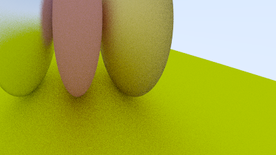

# 6. Surface Normals and Multiple Objects

## 6.3-6.4:

- No existe entidad `hit_record`, solo se devuelven los datos en `hit`.
	- El formato de la tupla es `(t, p, normal, front_face, material)`.

## 6.5:

- `HittableList` podría ser algo como `World`.

# 7. Antialiasing

## 7.2:

- ¿Se podría evitar el último for cuando el rayo no choca con nada? Probablemente ocasionaría que se pierda el antialiasing del fondo.

- ¿Usar otra distribución que no sea uniforme?

# 8. Diffuse Materials

## 8.2:

- Se volvió terriblemente lento.

- Al parecer sale más obscuro que en el libro.

	

	

	- Según el libro es por la corrección gamma, pero no me convence.
	- En efecto, la corrección gamma parece haberlo acomodado.

## 8.5-8.6:

- Me voy a quedar con la reflexión lambertiana.

- 
	>Scenes will become more complicated over the course of the book. You are encouraged to switch
	>between the different diffuse renderers presented here. Most scenes of interest will contain a
	>disproportionate amount of diffuse materials. You can gain valuable insight by understanding
	>the effect of different diffuse methods on the lighting of the scene.

	¿Modularizar renderers?

# 9. Metal

## 9.2:

- ¿Está bien que se devuelva el material en `hit`? ¿No tiene más sentido que el material sea una propiedad del `Hittable` o que directamente este se ocupe del `scatter`?

## 9.4:

- ¿`reflect` en `utility.py` o en `Metal`?

## 9.6:

- Hubo un intento de agregar multithreading, pero paradójicamente se volvió mucho más lento.

	- Según [esto](https://stackoverflow.com/questions/10789042/python-multi-threading-slower-than-serial) multithreading es problemático en Python para tareas intensivas en CPU, así que voy a usar procesos en lugar de hilos.
	- Se logró una pequeña mejora al repartir la carga de `ray_color`; el cálculo aleatorio del rayo sigue siendo serial.
	- Agregué el cálculo del rayo a los procesos, repartiendo la cantidad de muestras. El tiempo se redujo a la mitad, pero la salida no es la esperada.

	

	- Había confundido ancho y alto. Ya funciona todo bien y la mejora se mantuvo.
	- Definir un `chunksize` de 6 (`n_procs=8` y `samples_per_pixel=50`) parece dar tiempos un poco mejores que repartir de antemano.
	- Dejo `chunksize` de 12 (`n_procs=8` y `samples_per_pixel=100`).